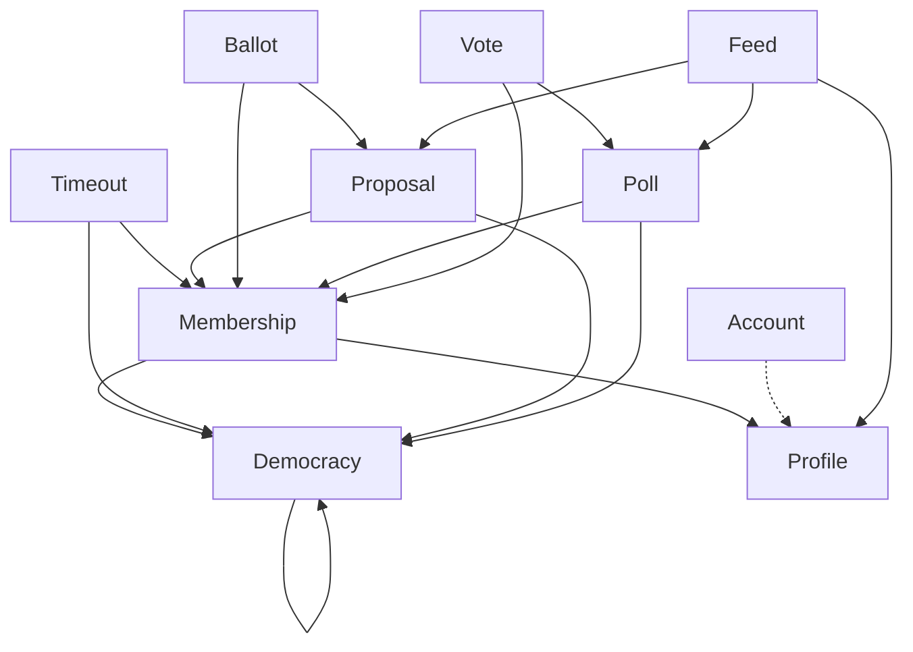
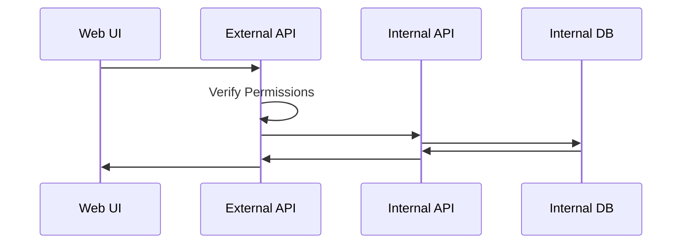
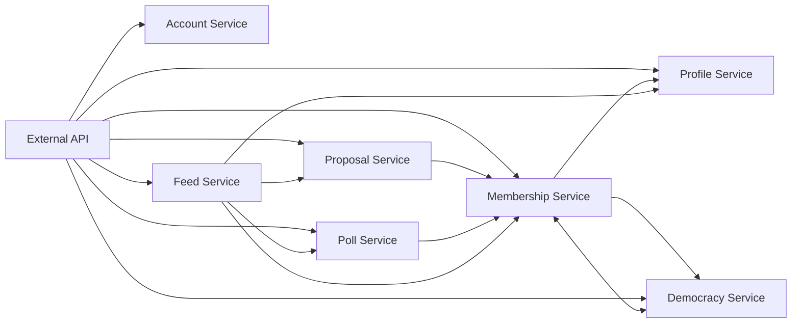

  

# Direct-Democracy

  

## Mission Statement

To upgrade and promote democracy.

## Goals

* Create a secure software platform to enable the free use of democratic tools.
* Promote direct-democracy and democracy generally.
* Allow for experimentation with different types and configurations of democracy.
  
## Status

This project is in active development, pre-release.

## License

This project is licensed under GPL3, with the exception of nazis. Nazis are not welcome here.

## Site Plans

### Concepts
#### Democracy
Democracies are at the core of the website. They are user-defined, except for the root, or site-wide democracy. The root democracy manages the site-wide code of conduct, voting algorithms, procedures and the creation/deletion of all other democracies.

##### Content
Each democracy maintains content. The content is determined by the context of the democracy. For example, the content of a democracy made for a government, might be it's legislation, by-laws or budgets. The content of a democracy made for some housemates, might be bill or chore schedules. The content of a democracy made for a research group, might be a data structure containing arguments about or results of experiments. All that's required, is that the content is in JSON format.

##### Inheritance
Democracies can have child democracies. These can be useful for subcommittees or other smaller groups within a democracy. All democracies have a parent, except for the root (site-wide) democracy. The root democracy is the default parent for a democracy, unless it is made under another.

##### Conduct

##### Meta Rules
##### Algorithms
##### Procedures
#### Membership
#### Proposals
#### Polls

### Processes
#### Modify Democracy
 1. A verified member of the democracy creates a proposal with the modification.
 2. Proposal is voted on by democracy members.
 3. The system periodically checks if conditions in the corresponding meta have been met.
 4. The system applies the changes if those conditions are met.

#### Add & Verify Democracy Membership
1. User creates membership. It is unverified by default.
2. Member verification proposal is automatically generated. The subject user is allowed to add comments to the proposal.
3. Proposal is voted on by verified democracy members.
4. The system periodically checks if conditions have been met in `meta.members.update`.
5. The system sets the member to verified, if those conditions are met.

#### Handling Member Conduct Violations
1. Member reports conduct violation(s) by other members. They are required to select which rule(s) have been violated.
2. Member timeout proposal is automatically generated. If a conduct violation is from an inherited rule, the timeout proposal will be created in the applicable parent democracy. The duration for the proposed timeout will be set based on number of previous infractions, and the configuration in `content.procedures` of the site-wide democracy.
3. The system periodically checks if conditions have been met in `meta.timeouts.add`.
4. The system puts the member in timeout, if those conditions have been met.
5. The member in timeout can still cast votes, but they cannot make proposals, polls or, if the timeout is site-wide, democracies. Their comments will also be hidden. These restrictions will be applied in the timeout democracy, and all of its descendent democracies.

TODO: removing timeouts via vote and timeout period expiration

#### Creating a Democracy
1.  

#### Deleting a Democracy
1. 

## Technical Plans
### Domain Model
#### Overview
Updated as new models are added to the code.

#### Democracy Structure

| Field |  Description |
|--|--|
| parent_id | ID of parent democracy. |
| name | Name of the democracy. |
| description | A description of the democracy. |
| population | The number of current members. |
| conduct | The code of conduct. The code of conduct for parent democracies are automatically added to child democracies. |
| content | The content being decided by the democracy. This is what the majority of proposals will be modifying. Contents are determined by the context of the democracy. | 
| meta_name | Conditions to update name. |
| meta_description | Conditions to update description. |
| meta_democracies | Conditions to add and remove democracies. |
| meta_members | Conditions to add, update and remove members. |
| meta_timeouts | Conditions to add and remove member timeouts. |
| meta_conduct | Conditions to add, update and remove rules of conduct. |
| meta_content | Conditions to add, update and remove the democracy's content. |
| meta_meta | Conditions to add, update or remove meta conditions. |

##### Examples:
- [Student Club](./docs/example-club.md)
- [Student Government](./docs/example-student.md)
- [Representative Government](./docs/example-representative.md)
- [Consolidated Knowledge](./docs/example-knowledge.md)
- [Site-Wide Democracy](./docs/example-root.md)

### Architecture

#### Overview
##### Web Request

##### Services

### Infrastructure

* [Local Development Mode](./docs/infra-local.md) - Simple infrastructure to run locally, during development.

  

### Libraries

* [Server](./libs/server/) - Server configuration and tools

* [Client](./libs/client) - Generates a client to use server's API

  

### Services

* [External API](./services/api/) - Coordinates API requests between services

* [Democracy](./services/api-democracy/) - Manages democracy definitions

* [Membership](./services/api-membership/) - Manages democracy memberships

* [Proposal](./services/api-proposal/) - Manages proposals and their votes

