# Authentication Scheme

## Contents
**Overview**
  * [Motivation](#motivation)
  * [Assumptions](#assumptions)
  * [Introduction](#introduction)
  
  **Proposal Overview**
  * [Terminology](#terminology)
  * [Sign In Overview](#sign-in-overview)
    * [Sign In Data](#sign-in-data)
    * [Sign In Request](#sign-in-request)
  * [Sign Up Overview](#sign-up-overview)
    * [Sign Up Data](#sign-up-data)
    * [Token Cleaning](#token-cleaning)
    * [Sign Up Request](#sign-up-request) 
  * [Limitations](#limitations)
  * [Questions and Concerns](#questions-and-concerns)

**Proposal Details**
  * [Sign In Details](#sign-in-details)
    * [Sign In Data](#sign-in-data-details)
    * [Sign In Request](#sign-in-request-details) 
  * [Sign Up Details](#sign-up-details) 
    * [Sign Up Data](#sign-up-data-details)
    * [Token Cleaning](#token-cleaning-details)
    * [Sign Up Request](#sign-up-request-details)

**Appendix**
  * [Overview of Selected Encryption Algorithms](#overview-of-selected-encryption-algorithms)

## Motivation
Allow for email login and account recovery while preserving the anonymity of users' votes.

## Assumptions
- It is fair to assume that all server-client communications are being monitored by some acronym mass surveillance programs.
  - So we should make sure that users' identities are protected, even if communications are compromised.
- It is fair to assume that a warrant may be issued for a copy of the database.
  - So we should make sure that users' identities are protected, even if the database is compromised. 
- It is fair to assume that data may be subject to quantum decryption, even if sometime in the future.
  - So we should make sure that encryption algorithms are reasonably quantum resistant.
- It is fair to assume that the user has taken all security precautions they can.
  - However, it is also fair to assume that any major power would be able to spy on any given individual.
    - This scheme only protects from mass surveillance, but can make individual surveillance more costly.
- It is fair to assume that we've taken all security precautions that we can for our servers.
  - However, it is also fair to assume that any major power would be able to hack our servers.
    - This scheme only protects from mass surveillance, but a distributed model should be considered for the future. 

## Introduction
The traditional approach to storing user data is with a single entry:
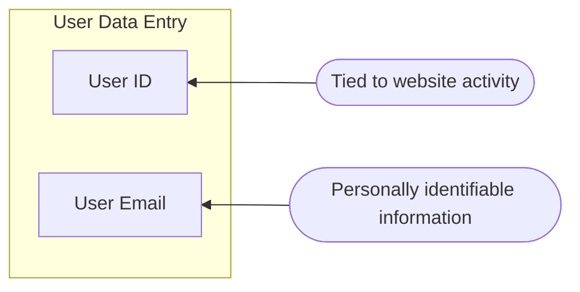
```mermaid
flowchart RL
	subgraph user[User Data Entry]
		user_id[User ID]
		email[User Email]
	end
pii([Personally identifiable information])  -->  email
wsa([Tied to website activity])  -->  user_id
```
This means that by stealing a copy of the database, the user's website activity (user ID) can be associated with their identifiable information (email).

The traditional approach to communication with the server:
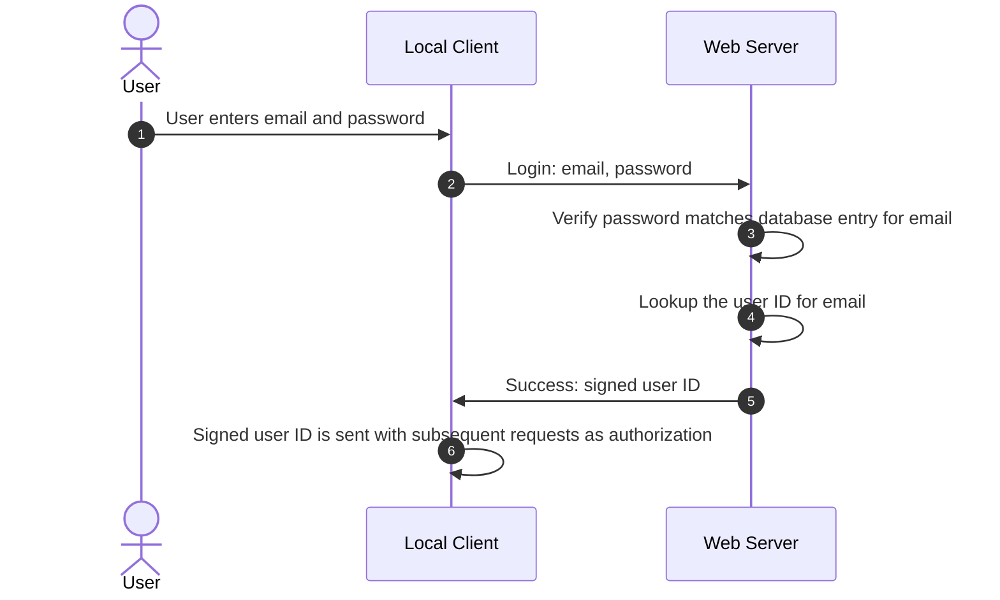
```mermaid
sequenceDiagram
    autonumber
    actor person as User
    participant user as Local Client
    participant server as Web Server

    person->>user: User enters email and password
    user->>server: Login: email, password
    server->>server: Verify password matches database entry for email
    server->>server: Lookup the user ID for email
    server->>user: Success: signed user ID
    user->>user: Signed user ID is sent with subsequent requests as authorization

```
This means that by spying on a single request and reply, the user's website activity (user ID) can be associated with their identifiable information (email).

Instead divide the data into two entries, one containing personal identifying information, and the other associated with website activity:
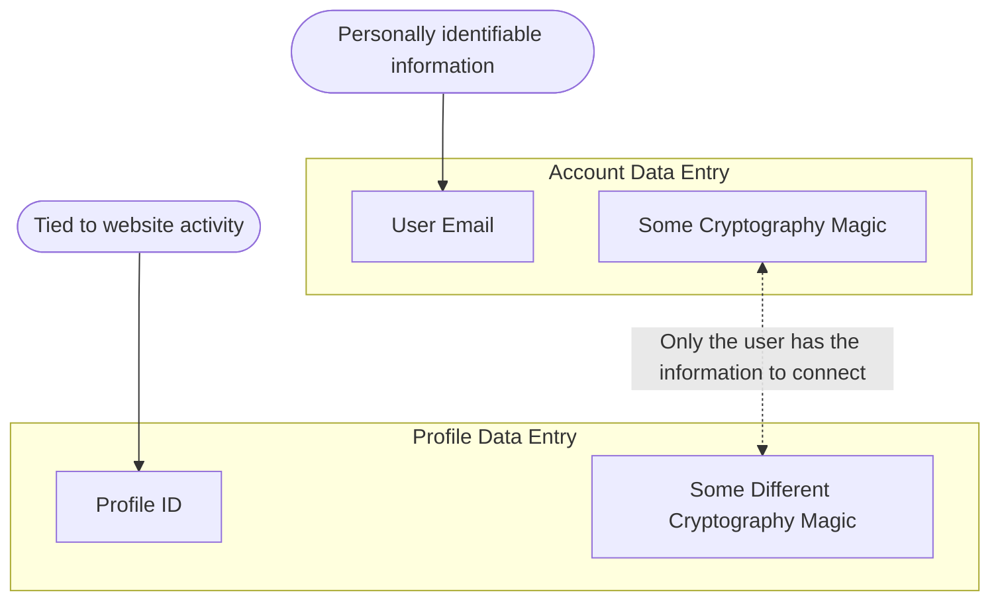
```mermaid
flowchart TD
	subgraph account[Account Data Entry]
		ai[User Email]
		am[Some Cryptography Magic]
	end
	subgraph profile[Profile Data Entry]
		pi[Profile ID]
		pm[Some Different Cryptography Magic]
	end 
	am <-.->|Only the user has the information to connect| pm
pii([Personally identifiable information])  -->  ai
wsa([Tied to website activity])  -->  pi
```
And divide the connection requests into two servers, one containing personal identifying information, and the other associated with website activity:
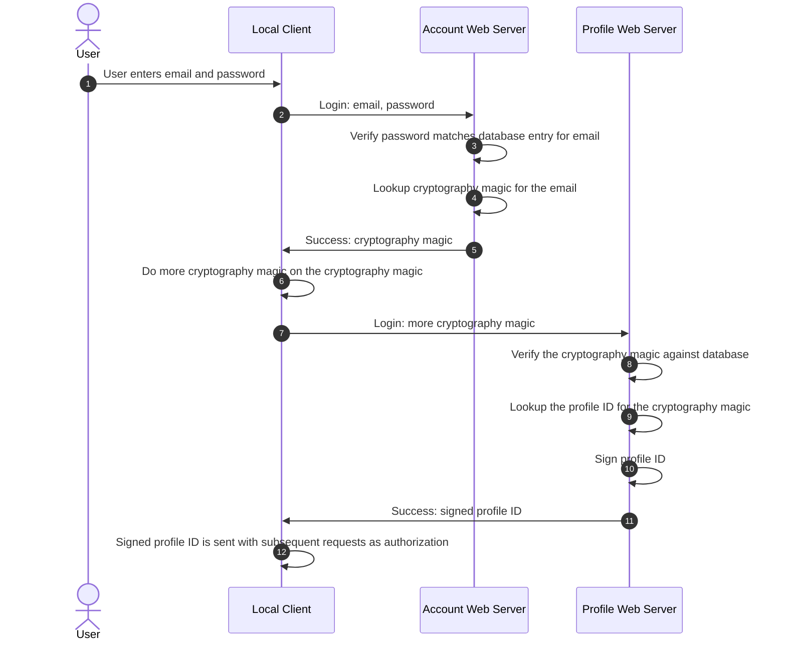
```mermaid
sequenceDiagram
    autonumber
    actor person as User
    participant user as Local Client  
	participant account as Account Web Server
	participant profile as Profile Web Server

    person->>user: User enters email and password
	user->>account: Login: email, password

	account->>account: Verify password matches database entry for email
    account->>account: Lookup cryptography magic for the email
	account->>user: Success: cryptography magic

	user->>user: Do more cryptography magic on the cryptography magic
	user->>profile: Login: more cryptography magic

	profile->>profile: Verify the cryptography magic against database
    profile->>profile: Lookup the profile ID for the cryptography magic
    profile->>profile: Sign profile ID
	profile->>user: Success: signed profile ID

	user->>user: Signed profile ID is sent with subsequent requests as authorization
```
The remainder of this document is proposing some ✨cryptography magic✨.

## Proposed Solution Overview
### Terminology
The following acronyms will be used:
* **JWT:** (JSON Web Token) Data in JSON format that has been cryptographically signed by the sender. The contents can't be changed once the token has been signed. It is often used as proof of authentication.
* **PKE:** (Public Key Exchange) A method to establish a shared secret or password over a public channel. This involves exchanging public keys, which when combined when secret private keys, generates a shared secret.
* **PAKE:** (Password Authenticated Key Exchange) A method that establishes a public key exchange, which is protected by a password that the user doesn't send to the server, and that the server itself doesn't know.
* **ZKPP:** (Zero Knowledge Password Proof) Allows someone to prove they have the password, without sending the password or anything that could derive it. Used by PAKEs.

Please see [selected encryption algorithms](#overview-of-selected-encryption-algorithms) for more details on the topics above and cryptography generally.

### Sign In Overview
#### Sign In Data
This data should already be available when signing in, as it is setup during the sign up process:
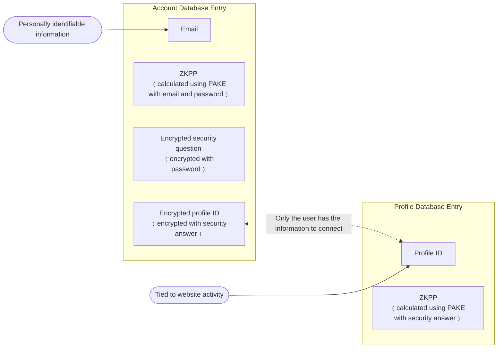
```mermaid
flowchart LR
    subgraph  account  [Account Database Entry]
        email[Email]
        avs[ZKPP <BR>﹙calculated using PAKE with email and password﹚]
        aeq[Encrypted security question <BR>﹙encrypted with password﹚]
        aep[Encrypted profile ID<BR>﹙encrypted with security answer﹚]
    end
    subgraph  profile  [Profile Database Entry]
        profile_id[Profile ID]
        evs[ZKPP<BR>﹙calculated using PAKE with security answer﹚]
    end
    aep <-.->|Only the user has the information to connect| profile_id
    pii([Personally identifiable information])  -->  email
    wsa([Tied to website activity])  -->  profile_id
```

#### Sign In Request
A high-level overview of the process that kicks off when a user signs in:
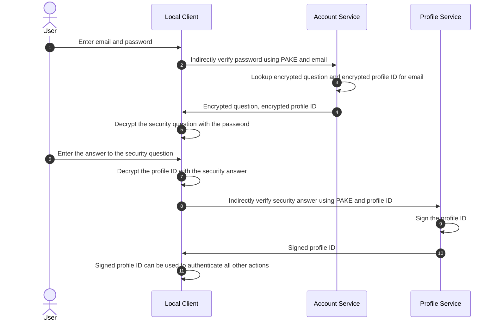
```mermaid
sequenceDiagram
    autonumber

    actor person as User
    participant user as Local Client
    participant account as Account Service
    participant profile as Profile Service

    person->>user: Enter email and password
    user->>account: Indirectly verify password using PAKE and email

    account->>account: Lookup encrypted question and encrypted profile ID for email
    account->>user: Encrypted question, encrypted profile ID

    user->>user: Decrypt the security question with the password
    person->>user: Enter the answer to the security question
    user->>user: Decrypt the profile ID with the security answer
    user->>profile: Indirectly verify security answer using PAKE and profile ID

    profile->>profile: Sign the profile ID
    profile->>user: Signed profile ID

    user->>user: Signed profile ID can be used to authenticate all other actions

```

### Sign Up Overview
#### Sign Up Data
The token service allows for the exchanging of 'tokens' (one time passwords) to permit account/profile verification. The process uses 'buckets' of random tokens, which need to be 'refilled' regularly. This is the process to refill the buckets:
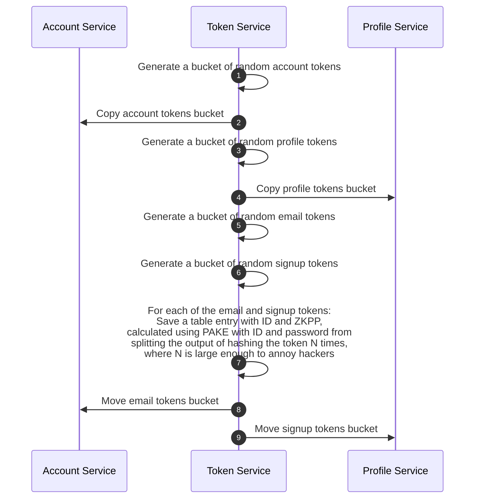
```mermaid
sequenceDiagram
    autonumber
    
    participant account as Account Service
    participant token as Token Service
    participant profile as Profile Service

    token->>token: Generate a bucket of random account tokens
    token->>account: Copy account tokens bucket
    token->>token: Generate a bucket of random profile tokens
    token->>profile: Copy profile tokens bucket
    token->>token: Generate a bucket of random email tokens
    token->>token: Generate a bucket of random signup tokens
    token->>token: For each of the email and signup tokens:<BR>Save a table entry with ID and ZKPP,<BR>calculated using PAKE with ID and password from<BR>splitting the output of hashing the token N times,<BR>where N is large enough to annoy hackers
    token->>account: Move email tokens bucket
    token->>profile: Move signup tokens bucket
```

#### Token Cleaning
The sign up process also requires token 'cleaning'. This is when we take a 'dirty' token - one which is associated with an account or profile ID - for a new shiney 'clean' token. This is the token cleaning process:
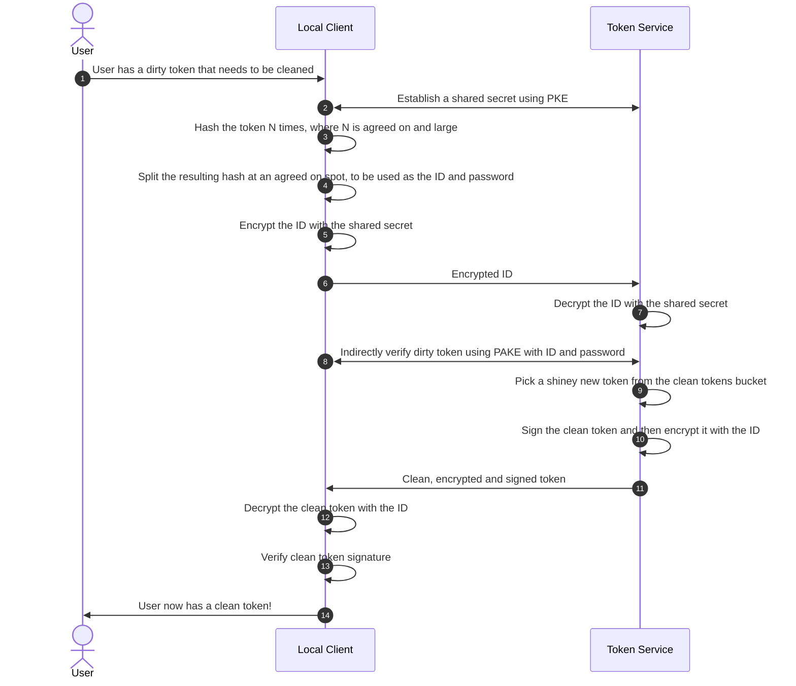
```mermaid
sequenceDiagram
    autonumber
    actor User
    participant Client as Local Client
    participant Verifier as Token Service

    User->>Client: User has a dirty token that needs to be cleaned
    Client<<->>Verifier: Establish a shared secret using PKE
    Client->>Client: Hash the token N times, where N is agreed on and large
    Client->>Client: Split the resulting hash at an agreed on spot, to be used as the ID and password
    Client->>Client: Encrypt the ID with the shared secret
    Client->>Verifier: Encrypted ID

    Verifier->>Verifier: Decrypt the ID with the shared secret
    Client<<->>Verifier: Indirectly verify dirty token using PAKE with ID and password
    Verifier->>Verifier: Pick a shiney new token from the clean tokens bucket
    Verifier->>Verifier: Sign the clean token and then encrypt it with the ID
    Verifier->>Client: Clean, encrypted and signed token


    Client->>Client: Decrypt the clean token with the ID
    Client->>Client: Verify clean token signature
    Client->>User: User now has a clean token!

```
#### Sign Up Request
A high-level overview of the process that kicks off when a user signs up:
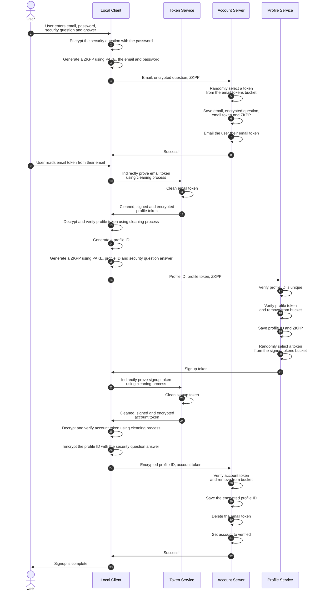
```mermaid
sequenceDiagram
    autonumber

    actor User
    participant Client as Local Client
    participant Verifier as Token Service
    participant Account as Account Server
    participant Profile as Profile Service

    User->>Client: User enters email, password, <BR>security question and answer
    Client->>Client: Encrypt the security question with the password
    Client->>Client: Generate a ZKPP using PAKE, the email and password
    Client->>Account: Email, encrypted question, ZKPP

    Account->>Account: Randomly select a token <BR>from the email tokens bucket
    Account->>Account: Save email, encrypted question, <BR>email token and ZKPP
    Account->>Account: Email the user their email token
    Account->>Client: Success!

    User->>Client: User reads email token from their email
    Client->>Verifier: Indirectly prove email token<BR> using cleaning process
    Verifier->>Verifier: Clean email token
    Verifier->>Client: Cleaned, signed and encrypted<BR> profile token

    Client->>Client: Decrypt and verify profile token using cleaning process
    Client->>Client: Generate a profile ID
    Client->>Client: Generate a ZKPP using PAKE, profile ID and security question answer
    Client->>Profile: Profile ID, profile token, ZKPP

    Profile->>Profile: Verify profile ID is unique
    Profile->>Profile: Verify profile token <BR>and remove from bucket
    Profile->>Profile: Save profile ID and ZKPP
    Profile->>Profile: Randomly select a token <BR>from the signup tokens bucket
    Profile->>Client: Signup token

    Client->>Verifier: Indirectly prove signup token<BR> using cleaning process
    Verifier->>Verifier: Clean signup token
    Verifier->>Client: Cleaned, signed and encrypted<BR> account token

    Client->>Client: Decrypt and verify account token using cleaning process
    Client->>Client: Encrypt the profile ID with the security question answer
    Client->>Account: Encrypted profile ID, account token

    Account->>Account: Verify account token <BR>and remove from bucket
    Account->>Account: Save the encrypted profile ID 
    Account->>Account: Delete the email token
    Account->>Account: Set account to verified
    Account->>Client: Success!
    Client->>User: Signup is complete!
```
   
### Limitations
- **Client security:** Users must have a secure system and access the website as securely as possible. This includes using a VPN/IP rotation/TOR, secure system/browser, secure local network, etc.
- **User security:** Users should avoid using an identifiable email address, easy or re-used passwords or an easy security question.
- **User self-reporting:** Users should avoid posting identifying information from their profile.
- **Timing:** The identity of users might be determinable by the timing of requests. See question 2 below.
- **Rooted server:** Though this scheme protects against an entity having access to the database or connection data, it does not protect against rooting. An entity that has root access can modify the code that is run, watch real time database changes and observe hardware. See question 4 below.

### Questions and Concerns
#### General
1. Does it pose a security risk to have AES-256 encrypted data stored with a SRP6a zero-knowledge password proof, if they both use the same password? If so how much? Are there alternative PAKEs we could use?
2. Could the identity of a user be determined by the timing of requests, even if they are masking their IP address? If so, how could we mitigate this? Add random delays? Make random requests?
3. What is the minimum number of users before the databases are reasonably resistant to brute force attacks?
4. What options do we have to protect against rooting? How could this be decentralized?
5. What needs to be done for post-quantum security? Can we just throw Kyber at it?
#### Sign In
1. Trolls could make fake login attempts to interrupt legitimate attempts. This is a problem with SRP which may be addressed by a different PAKE.
2. SRP-6a is subject to salt-leaking, which may be used in a dictionary attack. This should hopefully be addressed by a different PAKE.
#### Sign Up
1. The token cleaning table is fairly expensive to generate. Trolls could cause us to have to refill it prematurely with fake sign up requests.
2. The bucket refilling process must be carefully safe-guarded, as it could compromise all sign ups.

## Proposed Solution Details
The proposed solution, detailed with the assumption that the selected encryption algorithms are in use.
### Sign In Details
#### Sign In Data Details
This data should already be available when signing in, as it is setup during the sign up process:
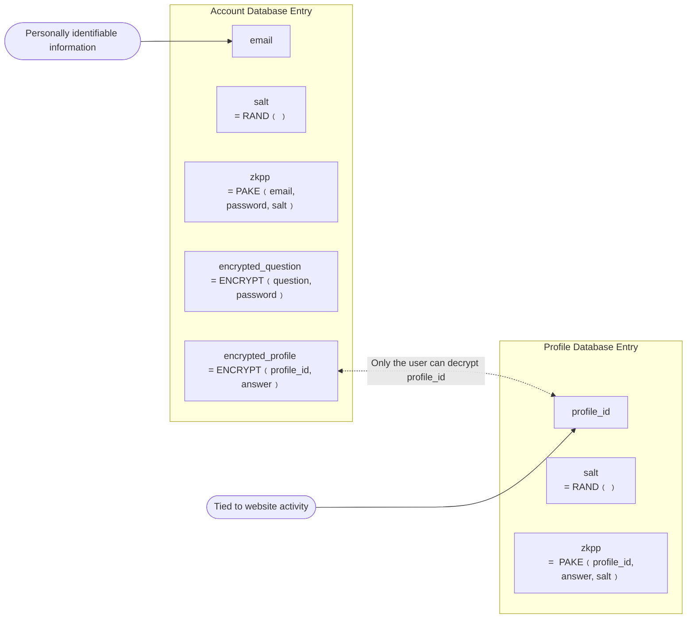
```mermaid
flowchart LR
    subgraph  account  [Account Database Entry]
        email[email]
        salt[salt<BR> = RAND﹙﹚]
        avs[zkpp <BR> = PAKE﹙email, password, salt﹚]
        aeq[encrypted_question <BR> = ENCRYPT﹙question, password﹚]
        aep[encrypted_profile <BR>= ENCRYPT﹙profile_id, answer﹚]
    end
    subgraph  profile  [Profile Database Entry]
        profile_id[profile_id]
        salt2[salt<BR> = RAND﹙﹚]
        evs[zkpp<BR> =  PAKE﹙profile_id, answer, salt﹚]
    end
    aep <-.->|Only the user can decrypt profile_id| profile_id
    pii([Personally identifiable information])  -->  email
    wsa([Tied to website activity])  -->  profile_id
```
#### Sign In Request Details
The process that kicks off when a user signs in:
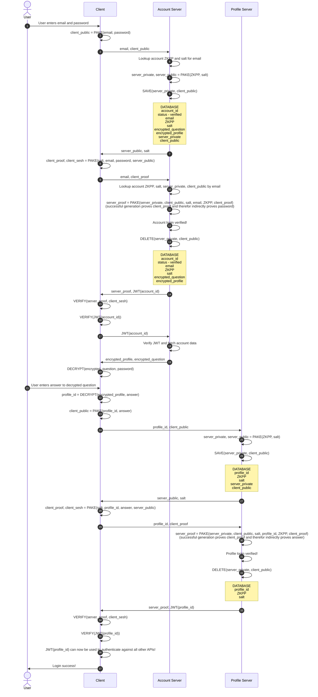
```mermaid
sequenceDiagram
    autonumber
    actor User
    participant Client
    participant Account as Account Server

    participant Profile as Profile Server

    User->>Client: User enters email and password
    Client->>Client: client_public = PAKE(email, password)
    Client->>Account: email, client_public

    Account->>Account: Lookup account ZKPP and salt for email
    Account->>Account: server_private, server_public = PAKE(ZKPP, salt)
    Account->>Account: SAVE(server_private, client_public)
    Note over Account: DATABASE<br>account_id<br>status - verified<br>email<br>ZKPP<br>salt<br>encrypted_question<br>encrypted_profile<br>server_private<br>client_public
    Account->>Client: server_public, salt

    Client->>Client: client_proof, client_sesh = PAKE(salt, email, password, server_public)
    Client->>Account: email, client_proof

    Account->>Account: Lookup account ZKPP, salt, server_private, client_public by email
    Account->>Account: server_proof = PAKE(server_private, client_public, salt, email, ZKPP, client_proof)<br>(successful generation proves client_proof and therefor indirectly proves password)
    Account->>Account: Account login verified!
    Account->>Account: DELETE(server_private, client_public)
    Note over Account: DATABASE<br>account_id<br>status - verified<br>email<br>ZKPP<br>salt<br>encrypted_question<br>encrypted_profile
    Account->>Client: server_proof, JWT(account_id)

    Client->>Client: VERIFY(server_proof, client_sesh)
    Client->>Client: VERIFY(JWT(account_id))

    Client->>Account: JWT(account_id)
    Account->>Account: Verify JWT and fetch account data
    Account->>Client: encrypted_profile, encrypted_question

    Client->>Client: DECRYPT(encrypted_question, password)
    User->>Client: User enters answer to decrypted question
    Client->>Client: profile_id = DECRYPT(encrypted_profile, answer)
    Client->>Client: client_public = PAKE(profile_id, answer)
    Client->>Profile: profile_id, client_public
    Profile->>Profile: server_private, server_public = PAKE(ZKPP, salt)
    Profile->>Profile: SAVE(server_private, client_public)
    Note over Profile: DATABASE<br>profile_id<br>ZKPP<br>salt<br>server_private<br>client_public
    Profile->>Client: server_public, salt

    Client->>Client: client_proof, client_sesh = PAKE(salt, profile_id, answer, server_public)

    Client->>Profile: profile_id, client_proof
    Profile->>Profile: server_proof = PAKE(server_private, client_public, salt, profile_id, ZKPP, client_proof)<br>(successful generation proves client_proof and therefor indirectly proves answer)
    Profile->>Profile: Profile login verified!
    Profile->>Profile: DELETE(server_private, client_public)
    Note over Profile: DATABASE<br>profile_id<br>ZKPP<br>salt
    Profile->>Client: server_proof, JWT(profile_id)

    Client->>Client: VERIFY(server_proof, client_sesh)
    Client->>Client: VERIFY(JWT(profile_id))
    Client->>Client: JWT(profile_id) can now be used to authenticate against all other APIs!
    Client->>User: Login success!
```

### Sign Up Details

#### Sign Up Data Details
The token service allows for the exchanging of ‘tokens’ (one time passwords) to permit account/profile verification. The process uses ‘buckets’ of random tokens, which need to be ‘refilled’ regularly. This is the process to refill the buckets:
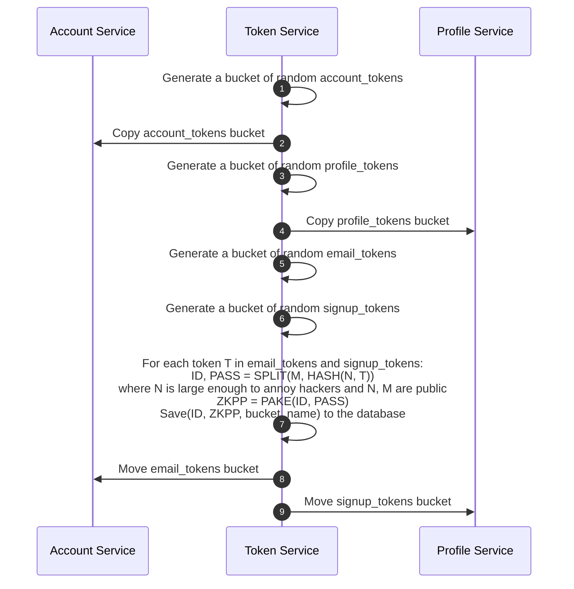
```mermaid
sequenceDiagram
    autonumber
    
    participant account as Account Service
    participant token as Token Service
    participant profile as Profile Service

    token->>token: Generate a bucket of random account_tokens
    token->>account: Copy account_tokens bucket
    token->>token: Generate a bucket of random profile_tokens
    token->>profile: Copy profile_tokens bucket
    token->>token: Generate a bucket of random email_tokens
    token->>token: Generate a bucket of random signup_tokens
    token->>token: For each token T in email_tokens and signup_tokens:<BR>ID, PASS = SPLIT(M, HASH(N, T))<BR>where N is large enough to annoy hackers and N, M are public<BR>ZKPP = PAKE(ID, PASS)<BR>Save(ID, ZKPP, bucket_name) to the database
    token->>account: Move email_tokens bucket
    token->>profile: Move signup_tokens bucket
```
#### Token Cleaning Details
The sign up process also requires token ‘cleaning’. This is when we take a ‘dirty’ token - one which is associated with an account or profile ID - for a new shiney ‘clean’ token. This is the token cleaning process:
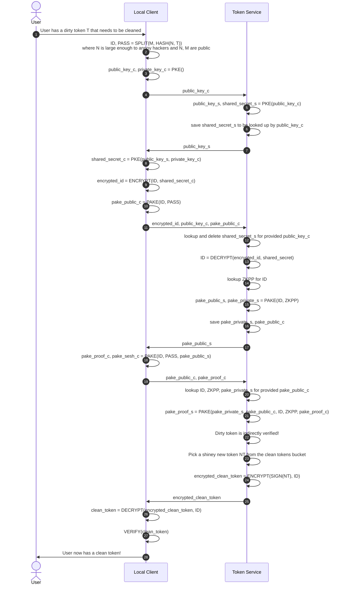
```mermaid
sequenceDiagram
    autonumber
    actor User
    participant Client as Local Client
    participant Verifier as Token Service

    User->>Client: User has a dirty token T that needs to be cleaned
    Client->>Client: ID, PASS = SPLIT(M, HASH(N, T))<BR>where N is large enough to annoy hackers and N, M are public
    Client->>Client: public_key_c, private_key_c = PKE()
    Client->>Verifier: public_key_c
    Verifier->>Verifier: public_key_s, shared_secret_s = PKE(public_key_c)
    Verifier->>Verifier: save shared_secret_s to be looked up by public_key_c
    Verifier->>Client: public_key_s
    Client->>Client: shared_secret_c = PKE(public_key_s, private_key_c)
    Client->>Client: encrypted_id = ENCRYPT(ID, shared_secret_c)
    Client->>Client: pake_public_c = PAKE(ID, PASS)
    Client->>Verifier: encrypted_id, public_key_c, pake_public_c
    Verifier->>Verifier: lookup and delete shared_secret_s for provided public_key_c
    Verifier->>Verifier: ID = DECRYPT(encrypted_id, shared_secret)
    Verifier->>Verifier: lookup ZKPP for ID
    Verifier->>Verifier: pake_public_s, pake_private_s = PAKE(ID, ZKPP)
    Verifier->>Verifier: save pake_private_s, pake_public_c
    Verifier->>Client: pake_public_s
    Client->>Client: pake_proof_c, pake_sesh_c = PAKE(ID, PASS, pake_public_s)
    Client->>Verifier: pake_public_c, pake_proof_c
    Verifier->>Verifier: lookup ID, ZKPP, pake_private_s for provided pake_public_c
    Verifier->>Verifier: pake_proof_s = PAKE(pake_private_s, pake_public_c, ID, ZKPP, pake_proof_c)
    Verifier->>Verifier: Dirty token is indirectly verified!


    Verifier->>Verifier: Pick a shiney new token NT from the clean tokens bucket
    Verifier->>Verifier: encrypted_clean_token = ENCRYPT(SIGN(NT), ID)
    Verifier->>Client: encrypted_clean_token


    Client->>Client: clean_token = DECRYPT(encrypted_clean_token, ID)
    Client->>Client: VERIFY(clean_token)
    Client->>User: User now has a clean token!
```

#### Sign Up Request Details
The process that kicks off when a user signs up:
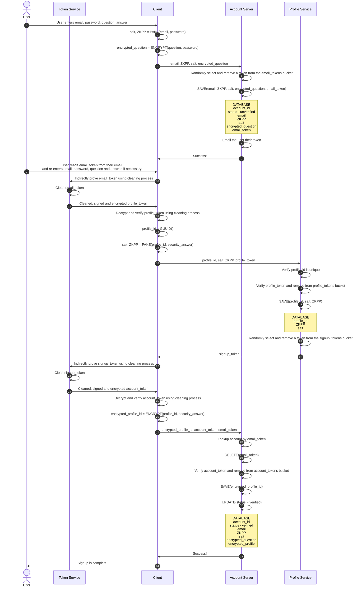
```mermaid
sequenceDiagram
    autonumber
    
    actor User
    participant Verifier as Token Service
    participant Client
    participant Account as Account Server

    participant Profile as Profile Service

    User->>Client: User enters email, password, question, answer
    Client->>Client: salt, ZKPP = PAKE(email, password)
    Client->>Client: encrypted_question = ENCRYPT(question, password)
    Client->>Account: email, ZKPP, salt, encrypted_question

    Account->>Account: Randomly select and remove a token from the email_tokens bucket
    Account->>Account: SAVE(email, ZKPP, salt, encrypted_question, email_token)
    Note over Account: DATABASE<br>account_id<br>status - unverified<br>email<br>ZKPP<br>salt<br>encrypted_question<br>email_token
    Account->>Account: Email the user their token
    
    Account->>Client: Success!

    User->>Client: User reads email_token from their email<BR>and re-enters email, password, question and answer, if necessary
    Client->>Verifier: Indirectly prove email_token using cleaning process
    Verifier->>Verifier: Clean email_token
    Verifier->>Client: Cleaned, signed and encrypted profile_token
    Client->>Client: Decrypt and verify profile_token using cleaning process

    Client->>Client: profile_id = GUUID()
    Client->>Client: salt, ZKPP = PAKE(profile_id, security_answer)
    Client->>Profile: profile_id, salt, ZKPP, profile_token

    Profile->>Profile: Verify profile_id is unique
    Profile->>Profile: Verify profile_token and remove from profile_tokens bucket
    Profile->>Profile: SAVE(profile_id, salt, ZKPP)
    Note over Profile: DATABASE<br>profile_id<br>ZKPP<br>salt
    Profile->>Profile: Randomly select and remove a token from the signup_tokens bucket
    Profile->>Client: signup_token

    Client->>Verifier: Indirectly prove signup_token using cleaning process
    Verifier->>Verifier: Clean signup_token
    Verifier->>Client: Cleaned, signed and encrypted account_token
    Client->>Client: Decrypt and verify account_token using cleaning process    

    Client->> Client: encrypted_profile_id = ENCRYPT(profile_id, security_answer)
    Client->>Account: encrypted_profile_id, account_token, email_token

    Account->>Account: Lookup account by email_token
    Account->>Account: DELETE(email_token)
    Account->>Account: Verify account_token and remove from account_tokens bucket
    Account->>Account: SAVE(encrypted_profile_id)
    Account->>Account: UPDATE(status = verified)
    Note over Account: DATABASE<br>account_id<br>status - verified<br>email<br>ZKPP<br>salt<br>encrypted_question<br>encrypted_profile
    Account->>Client: Success!
    Client->>User: Signup is complete!
```

## Appendix
### Overview of Selected Encryption Algorithms
#### Symmetric Encryption
_Simple encryption when both sides know the password_
- **Selected Algorithm:** Advanced Encryption Standard, Length: 256 bit
- **Mathematical Basis:** substitution-permutation network
- **Quantum Resistance:** considered quantum-resistant for 256 bit length
- **Security:** used by NSA for top secret documents
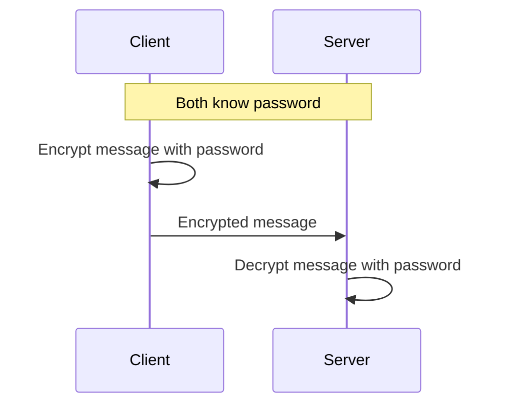
```mermaid
sequenceDiagram
participant  Client
participant  Server
Note  over  Client,Server: Both know password
Client->>Client: Encrypt message with password
Client->>Server: Encrypted message
Server->>Server: Decrypt message with password
```

#### Public Key Exchange
_Public key exchange for encryption when there is no shared password_
- **Selected Algorithm:** Elliptic Curve Diffie-Hellman, Curve: 25519
- **Mathematical Basis:** elliptic curve discrete logarithms
- **Quantum Resistance:** considered quantum-resistant when combined with post-quantum key encapsulation like in PQXDH
- **Security:** used by Signal, WhatsApp
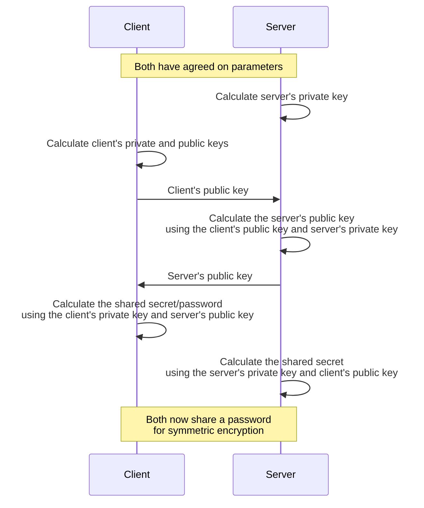
```mermaid
sequenceDiagram
participant  Client
participant  Server
Note  over  Client,Server: Both have agreed on parameters
Server->>Server: Calculate server's private key
Client->>Client: Calculate client's private and public keys
Client->>Server: Client's public key
Server->>Server: Calculate the server's public key <BR>using the client's public key and server's private key
Server->>Client: Server's public key
Client->>Client: Calculate the shared secret/password <BR>using the client's private key and server's public key
Server->>Server: Calculate the shared secret<BR> using the server's private key and client's public key
Note over Client,Server: Both now share a password<BR>for symmetric encryption
```

#### Cryptographic Hash
_Generate a random-seeming but repeatable sequence of values_
- **Selected Algorithm:** Keccak 256
- **Mathematical Basis:** sponge construction?
- **Quantum Resistance:** likely not
- **Security:** Used by Ethereum, SHA-3 winner
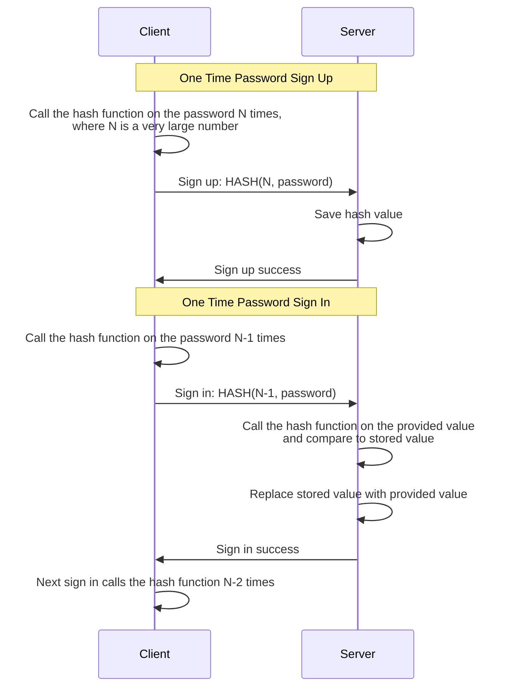
```mermaid
sequenceDiagram
		participant  Client
		participant  Server
		Note over Client,Server: One Time Password Sign Up
    Client->>Client: Call the hash function on the password N times,<br> where N is a very large number
    Client->>Server: Sign up: HASH(N, password)
    Server->>Server: Save hash value
    Server->>Client: Sign up success
    Note over Client,Server: One Time Password Sign In
    Client->>Client: Call the hash function on the password N-1 times
    Client->>Server: Sign in: HASH(N-1, password)
		Server->>Server: Call the hash function on the provided value<br> and compare to stored value
		Server->>Server: Replace stored value with provided value
		Server->>Client: Sign in success
		Client->>Client: Next sign in calls the hash function N-2 times
```

#### Password Authenticated Key Exchange
_Prove you have a password without sending it to the server_
- **Selected Protocol:** SRP6a - though this probably needs to be changed
- **Mathematical Basis:** modular exponentiation + hashing
- **Quantum Resistance:** unclear, but could likely use post-quantum key encapsulation
- **Security:** used by Proton Mail, OpenSSL winner
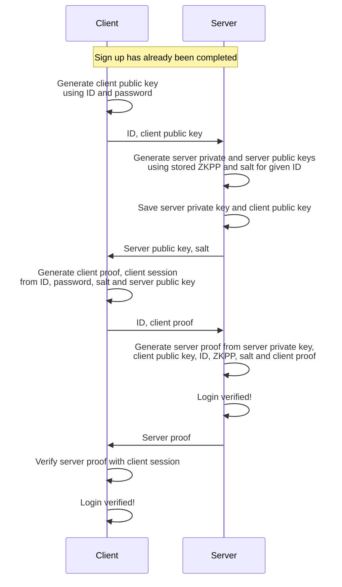
```mermaid
sequenceDiagram
	participant  Client
	participant  Server
    Note over Client,Server: Sign up has already been completed
    Client->>Client: Generate client public key<BR>using ID and password
    Client->>Server: ID, client public key
    Server->>Server: Generate server private and server public keys <br>using stored ZKPP and salt for given ID
    Server->>Server: Save server private key and client public key
    Server->>Client: Server public key, salt
    Client->>Client: Generate client proof, client session <br>from ID, password, salt and server public key
    Client->>Server: ID, client proof
    Server->>Server: Generate server proof from server private key,<br> client public key, ID, ZKPP, salt and client proof
    Server->>Server: Login verified!
    Server->>Client: Server proof
    Client->>Client: Verify server proof with client session
    Client->>Client: Login verified!
```

