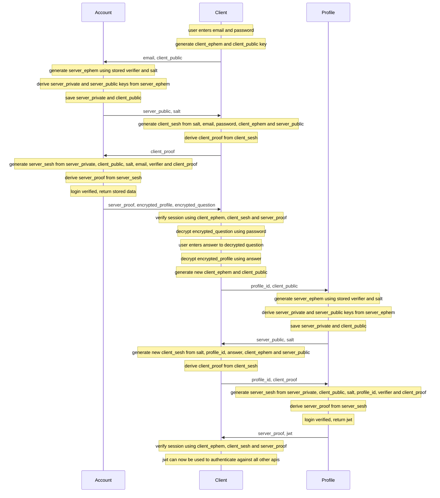
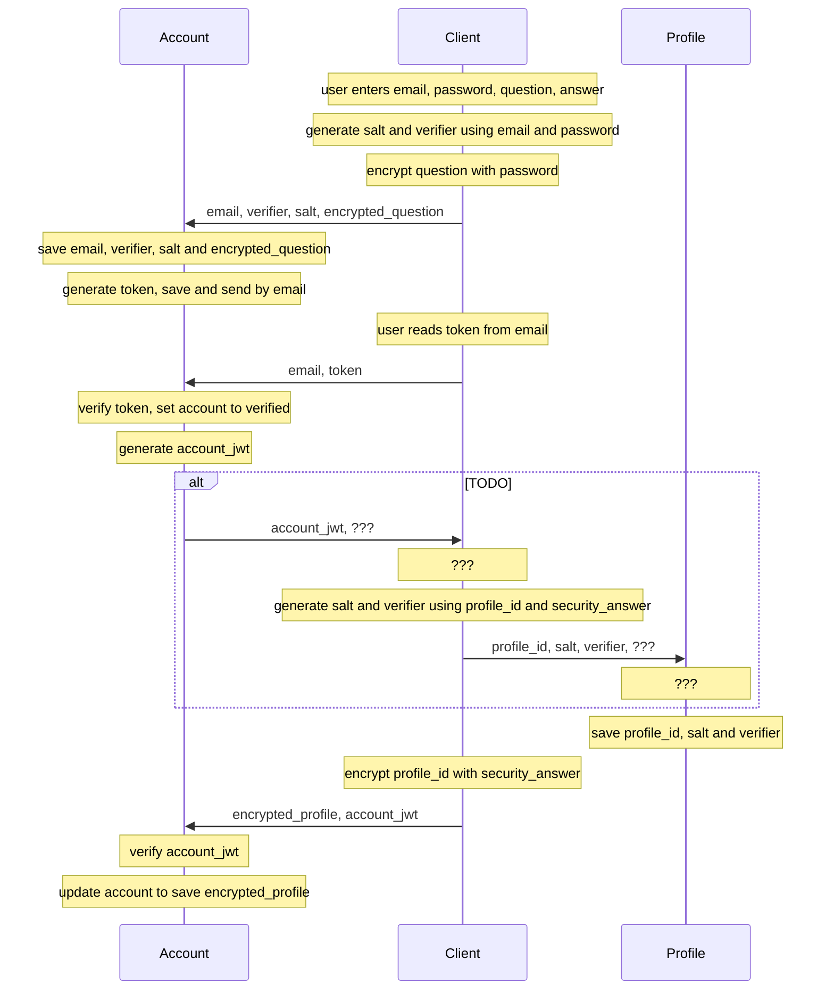
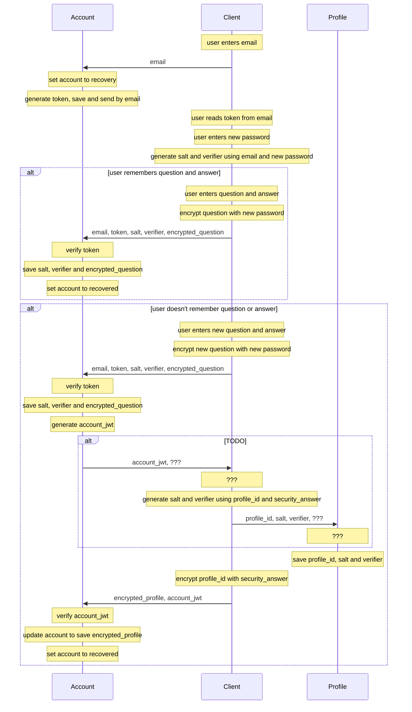

# Authentication Scheme

## Motivation
Allow for email login and account recovery, while preserving the anonymity of users, even if the server's database has been compromised.

## Sign In

## Sign Up

## Recovery

   
