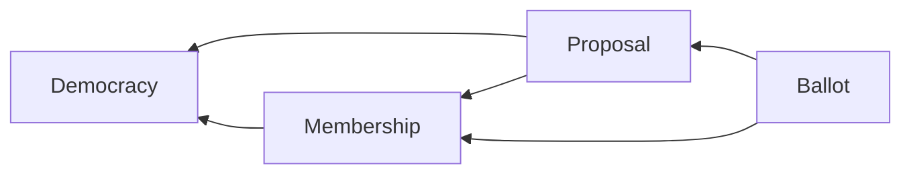
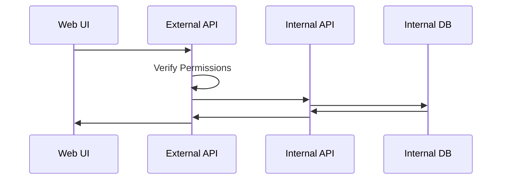

# Developer Documentation


## Get Started
To get a local instance running in development mode:

```
git clone https://github.com/AluminumOxide/direct-democracy.git
cd direct-democracy/infra/dev/
terraform init
terraform apply
```
[More information on contributing](../CONTRIBUTING.md)

## Overview
### Domain Diagram


### Architecture


## Services
* [Democracy](../services/api-democracy/) - Manages democracy definitions
* [Membership](../services/api-membership/) - Manages democracy memberships
* [Proposal](../services/api-proposal/) - Manages proposals and their votes

## Infrastructure
* [Local Development Mode](../infra/dev/) - Simple infrastructure to run locally for development.

## Libraries
* [Server](../libs/server/) - Server configuration and tools
* [Client](../libs/client) - Generates a client to use server's API
* [JSON Changes](../libs/json_changes) - Checks and applies changes formatted in JSON

