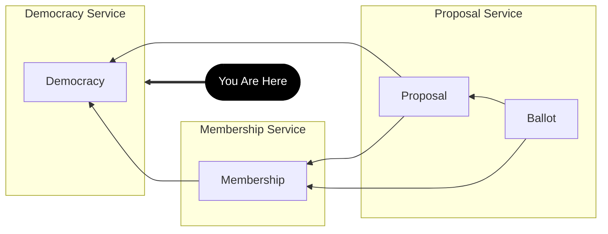
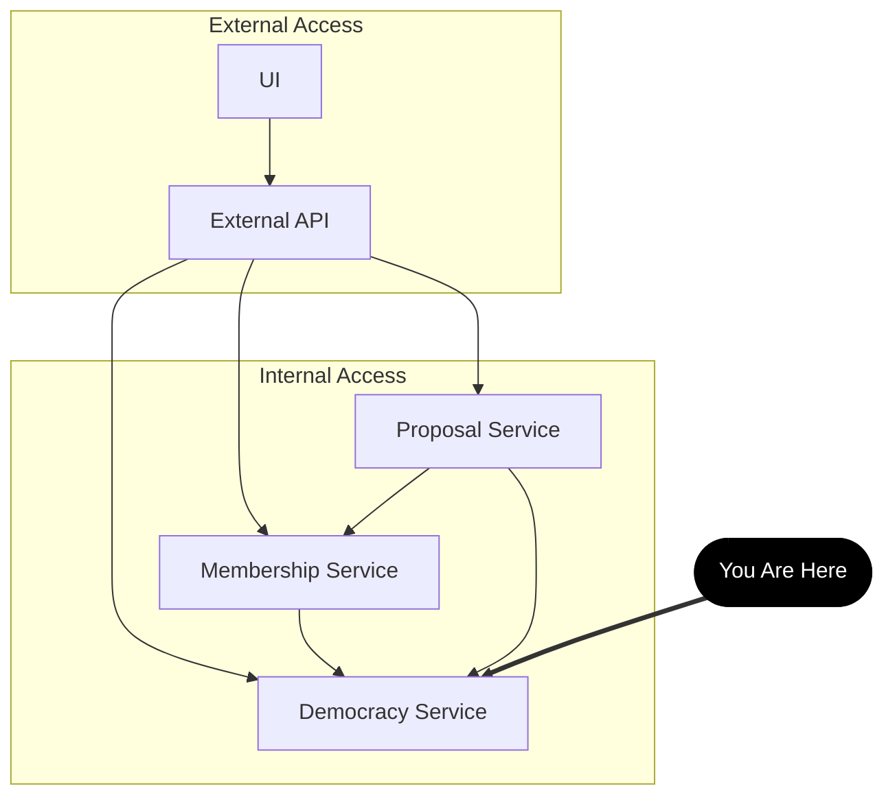

# Democracy Service

## Data

Database tables are [documented](./schema/README.md) and specified in [/schema](./schema/). Each table has a `.sql` definition file and associated `.json` file containing test data. These files are loaded by the database docker container, which is managed by terraform in [/infra](../../infra).

## APIs

API routes are specified in [spec.json](./spec.json). [Documentation](./source/README.md) is auto-generated from `spec.json` on server start. For convenience, consider using the [democracy service client library](./client/) for service access.

## Jobs

| Job | Frequency | Description |
| -- | -- | -- |
| Population | 5 min | Update the population for any democracy that has had new or updated memberships. Communicates with the membership service. |
