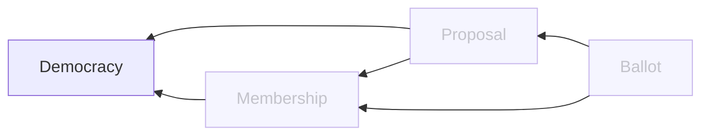

# Democracy Service

## Overview

### Domain Diagram

## APIs
TODO

## Data
### Democracy
| Field | Type | Description |
| -- | -- | -- |
| id                    | UUID      | ID of the democracy |
| parent_id             | UUID      | ID of parent the democracy |
| name                  | VARCHAR   | Name of the democracy |
| description           | VARCHAR   | Description of the democracy |
| population_verified   | INT       | Verified population of the democracy |
| population_unverified | INT       |  Unverified population of the democracy |
| conduct               | JSONB     | Code of conduct of the democracy |
| content               | JSONB     | Content decided by the democracy members |
| metas                 | JSONB     | Rules for modification of the democracy |
| date_created          | TIMESTAMP | Date the democracy was created |
| date_updated          | TIMESTAMP | Date the democracy was last updated

## Jobs
| Job | Frequency | Description |
| -- | -- | -- |
| Population | 5 min | Update the population for any democracy that has had new or updated memberships. Communicates with the membership service. |