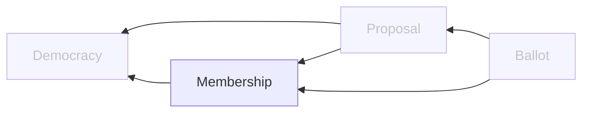

# Membership Service

## Overview

### Domain Diagram

## APIs
TODO

## Data
### Membership
| Field | Type | Description |
| -- | -- | -- |
| id                    | UUID      | ID of the membership |
| profile_id            | UUID      | ID of the membership's profile |
| is_verified           | BOOLEAN   | If the membership has been verified |
| date_created          | TIMESTAMP | Date the democracy was created |
| date_updated          | TIMESTAMP | Date the democracy was last updated |

