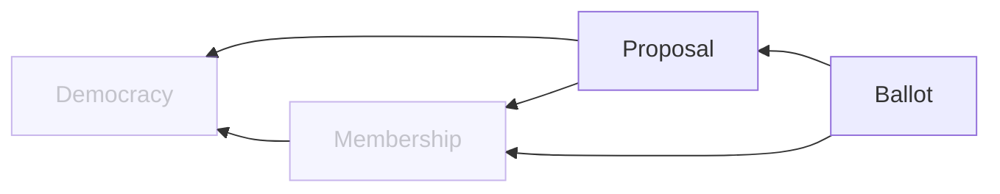

# Proposal Service

## Overview

### Domain Diagram

## APIs
TODO

## Data
### Proposal
| Field | Type | Description |
| -- | -- | -- |
| id                    | UUID      | ID of the proposal |
| democracy_id          | UUID      | ID of the proposal's democracy |
| membership_id         | UUID      | Membership ID of the proposal's creator |
| name                  | VARCHAR   | Name of the proposal |
| description           | VARCHAR   | Description of the proposal |
| target                | VARCHAR   | Target of the proposal |
| changes               | JSONB     | Changes proposed by the proposal |
| votable               | BOOLEAN   | If the proposal can currently be voted for |
| passed                | BOOLEAN   | If the proposal has passed |
| date_created          | TIMESTAMP | Date the proposal was created |
| date_updated          | TIMESTAMP | Date the proposal was last updated |

### Ballot
| Field | Type | Description |
| -- | -- | -- |
| id                    | UUID      | ID of the ballot |
| proposal_id           | UUID      | ID of the ballot's proposal |
| membership_id         | UUID      | Membership ID of the ballot |
| is_approved           | BOOLEAN   | If the ballot approves the proposal |
| is_verified           | BOOLEAN   | If the ballot was cast by a verified member |
| modifiable            | BOOLEAN   | If the ballot can be modified |
| comments              | VARCHAR   | Optional comments for the ballot |
| date_created          | TIMESTAMP | Date the ballot was created |
| date_updated          | TIMESTAMP | Date the ballot was last updated |

